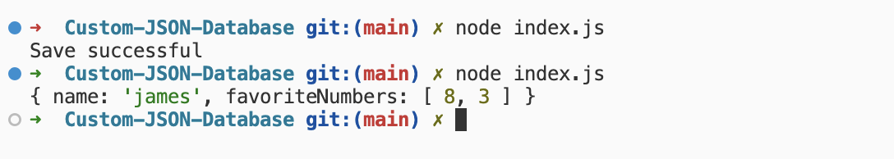

# Custom-JSON-Database

Given the importance of databases and data persistence in software engineering, I have written this custom JSON database. This allows me to keep information safe between page refreshes, file reloads, extra security via backup files and prevent losing information as a whole.

### Methodology

1. Read JSON object from file.

2. Parse the JSON from JSON to the object and return it.

3. Check that a user has passed in an object.

4. Convert our object to the JSON format.

5. Save JSON to our JSON database.

### Output

